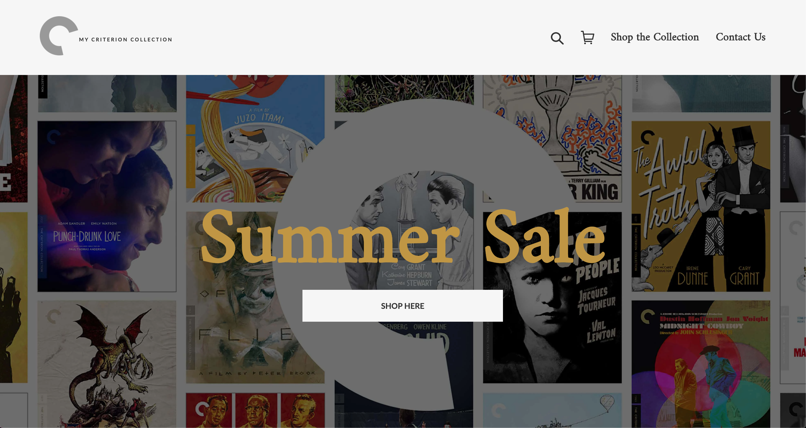

# My Criterion Collection | A Film Store

[Live Demo](https://myfilmstore.myshopify.com/)

## Description:
This is a custom theme development project built from a base theme kit. I made the template from scratch by writing Liquid in HTML5, styling it with CSS3 & Sass, and adding Javascript and jQuery for the functionality of it. This Shopify store is for film lovers who collect and study cinematic gems from the Criterion Collection. It has variety of inventories with a huge number of titles in each section. Flip through all lists, filter your favourite filmmaker, sort titles by different criteria, add titles to your cart and update/remove your favorites.

## Built with:

* Liquid
* Shopify
* HTML5
* CSS3/ Sass
* JavaScript
* VSCode
